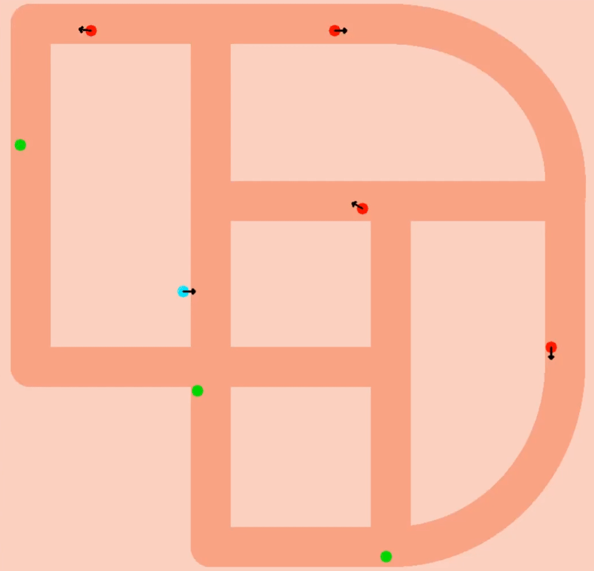
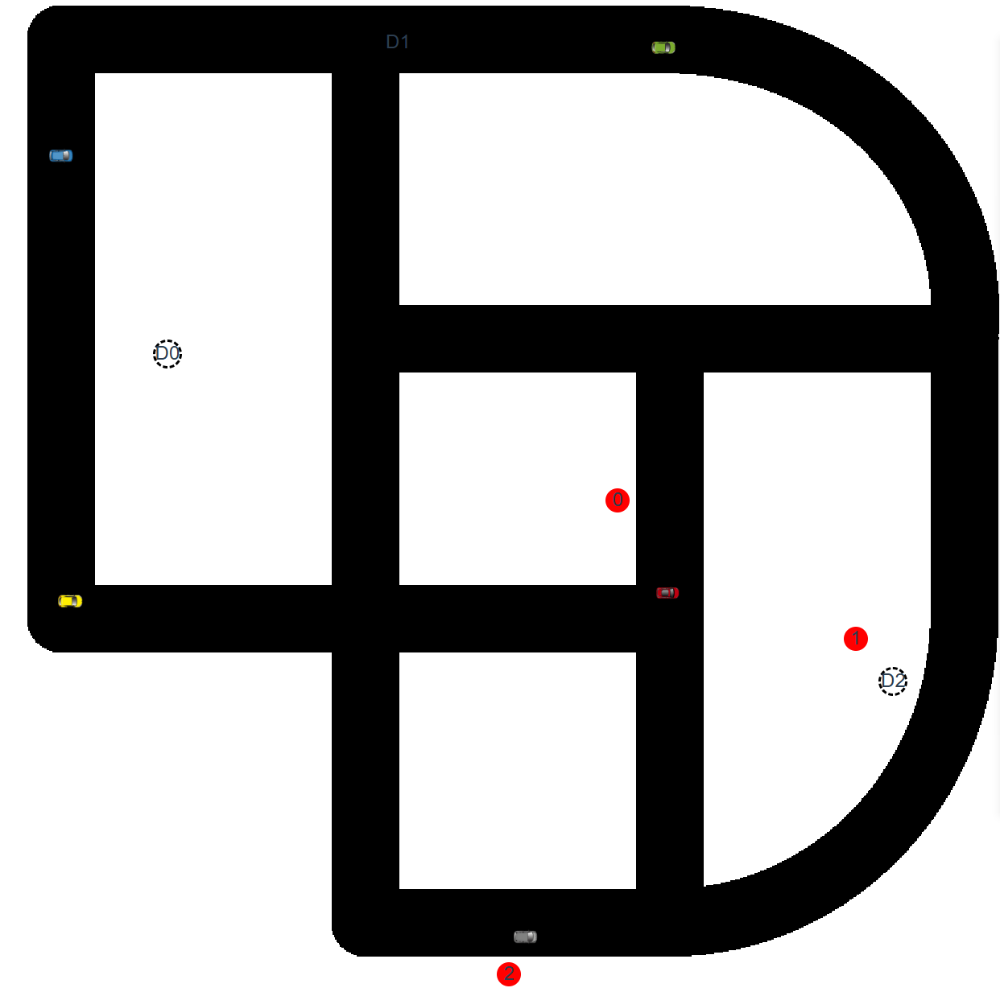
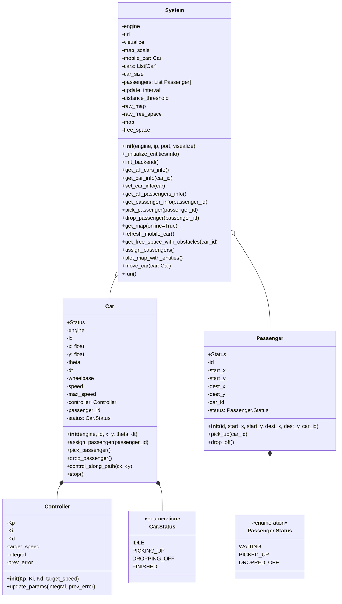

# Vehicle-Routing-Sim

    

    

# Simulation System
## UML

```mermaid
classDiagram
    class System {
        -engine
        -url
        -visualize
        -map_scale
        -mobile_car: Car
        -cars: List[Car]
        -car_size
        -passengers: List[Passenger]
        -update_interval
        -distance_threshold
        -raw_map
        -raw_free_space
        -map
        -free_space
        +__init__(engine, ip, port, visualize)
        +_initialize_entities(info)
        +init_backend()
        +get_all_cars_info()
        +get_car_info(car_id)
        +set_car_info(car)
        +get_all_passengers_info()
        +get_passenger_info(passenger_id)
        +pick_passenger(passenger_id)
        +drop_passenger(passenger_id)
        +get_map(online=True)
        +refresh_mobile_car()
        +get_free_space_with_obstacles(car_id)
        +assign_passengers()
        +plot_map_with_entities()
        +move_car(car: Car)
        +run()
    }

    class Car {
        +Status
        -engine
        -id
        -x: float
        -y: float
        -theta
        -dt
        -wheelbase
        -speed
        -max_speed
        -controller: Controller
        -passenger_id
        -status: Car.Status
        +__init__(engine, id, x, y, theta, dt)
        +assign_passenger(passenger_id)
        +pick_passenger()
        +drop_passenger()
        +control_along_path(cx, cy)
        +stop()
    }

    class Controller {
        -Kp
        -Ki
        -Kd
        -target_speed
        -integral
        -prev_error
        +__init__(Kp, Ki, Kd, target_speed)
        +update_params(integral, prev_error)
    }

    class Passenger {
        +Status
        -id
        -start_x
        -start_y
        -dest_x
        -dest_y
        -car_id
        -status: Passenger.Status
        +__init__(id, start_x, start_y, dest_x, dest_y, car_id)
        +pick_up(car_id)
        +drop_off()
    }

    class Passenger.Status {
        <<enumeration>>
        WAITING
        PICKED_UP
        DROPPED_OFF
    }

    class Car.Status {
        <<enumeration>>
        IDLE
        PICKING_UP
        DROPPING_OFF
        FINISHED
    }

    System o-- Car
    System o-- Passenger
    Car *-- Controller
    Car *-- Car.Status
    Passenger *-- Passenger.Status
%%  Car "1" <--> "1" Passenger
```